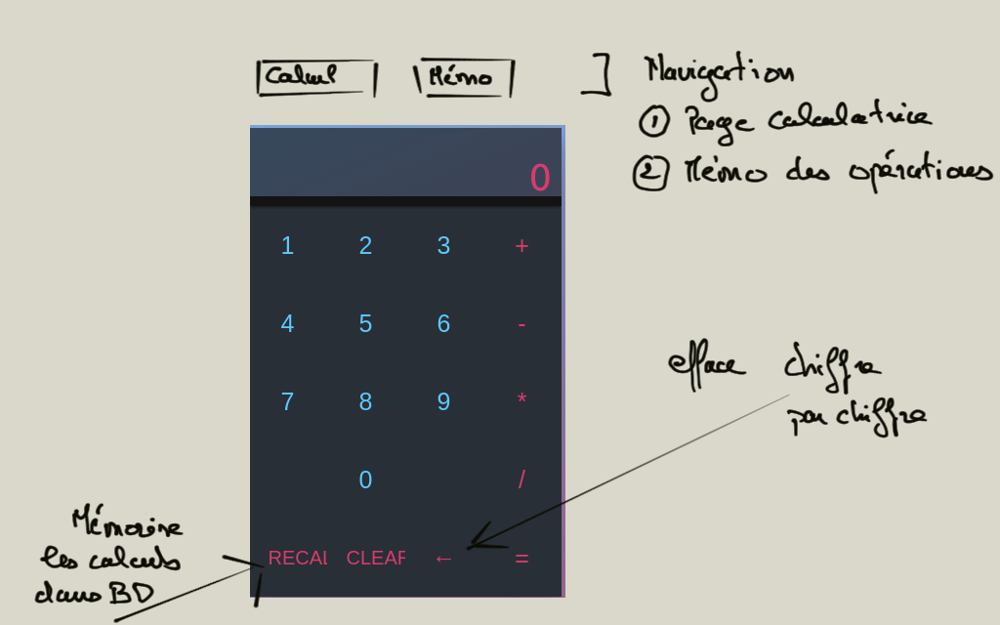

# Calculatrice

Vous allez développer une petite calculatrice.

## Contraintes

- Vous utiliserez React ou React Native & globaliser un state avec un context & useReducer ou  Redux.

- Si vous utilisez React et que vous maîtrisez bien le sujet l'utilisation des Hooks est un plus.

- Vous utiliserez également une persistance soit dans un localStorage ou une base de données externes de votre choix pour faire persister des données.

- Vous utiliserez les techniques suivantes :

    - Composition dans React

    - **propTypes** pour vérifier le type des props

    - Un module externe pour le routing.

    - Sass avec Bootstrap, des variables Sass pour la gestion des assets.

    - L'ensemble des techniques vues en cours pour optimiser l'application.

    - Si vous avez le temps vous testerez votre application.

    - Vous utiliserez pour les formulaires Formik (facultatif).

    - Vous testerez deux features (facultatif).

L'application sera "pushée" sur un dépôt Git (public) accessible pour la correction. L'application devra être buildée pour vérifier que tout fonctionne correctement, je le ferai de mon côté. Le build n'est pas à mettre sur le dépôt Git.

## Première page "Calcul"

La première page présentera la calculatrice avec ses différentes fonctionnalitées décritent dans le Wireframe ci-dessous, en particulier "recal" permettra de mémoriser les calculs effectués dans une DB ou localStorage.

## deuxième page "Mémo"

Cette page présentera l'ensemble des calculs effectués par la calculatrice dans un tableau HTML Bootstrap. Un bouton sera visible sur la page (attention à la sémantique de la page) afin d'effacer le mémo des calculs.

## Remarques

Je reste à votre disposition pour soit ajouter des fonctionnalités à cette calculatrice, soit pour répondre à des questions sur des aspects mise en place de techniques vues en cours.

Vous serez durant le developpement interrogé sur la technique.

Bon courage à tous.
